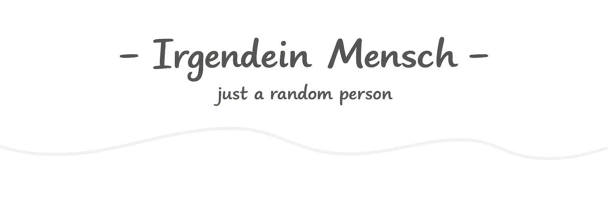

  

  <em>I write code, build random projects and spend way too much time fixing problems I probably created myself :)</em>

  Got an idea? Let's make it happen (what could possibly go wrong)

## 🚀 Projects & Stuff

<b>🍪 Cookie</b>

 

I'm part of the development team behind **Cookie**, a Discord bot packed with features like economy, leveling, moderation, tickets and more.

<b>💭 Soulshine</b>

 

Soulshine is a community I created where I spend most of my time on Discord. It's a place to game, chat and just hang out.

<b>🌐 Portfolio</b>

 

Not started yet, but it's coming... eventually. Future me will handle it. Until then, my repos are the portfolio :)

## ⚙️ Tech Stack

**Languages**

  
  
  
  
  

**Backend & Tools**

  
  
  
  

**Databases**

  
  

## 📊 GitHub Stats  

  

---

  
  &nbsp;
  

